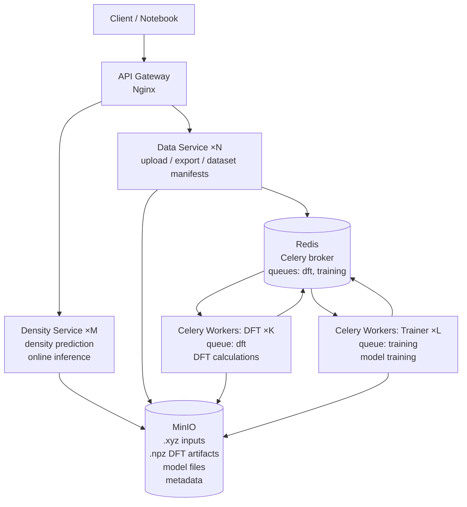

# DFT Workflow

DFT Workflow: сервисный стек для обработки молекулярных `.xyz` файлов, расчёта DFT через PySCF, обучения моделей (MACE) и предсказания матриц плотности через HTTP API.

Проект запускается через Docker Compose и включает FastAPI-сервисы, Celery-воркеры, Redis-очереди, MinIO-хранилище и Nginx как единый API gateway.

## Архитектура



## Поток данных

```mermaid
flowchart LR
flowchart LR
    NewData["New data .xyz"]

    DataService["Data Service"]

    MinIORaw[("MinIO<br/>raw molecules (.xyz)")]

    RedisDft[("Redis<br/>queue: dft")]

    DftRunner["Celery Workers: DFT<br/>DFT calculation"]

    MinIODft[("MinIO<br/>DFT artifacts (.npz)")]

    RedisTrain[("Redis<br/>queue: training")]

    Trainer["Celery Workers: Trainer<br/>training / fine-tuning"]

    MinIOModels[("MinIO<br/>model files<br/>model.pt / config / metrics")]

    DensityService["Density Service<br/>online ML inference"]

    Client["Client / Notebook"]

    NewData --> DataService

    DataService --> MinIORaw
    DataService --> RedisDft

    RedisDft --> DftRunner

    MinIORaw --> DftRunner

    DftRunner --> MinIODft
    DftRunner --> RedisTrain

    RedisTrain --> Trainer

    MinIODft --> Trainer

    Trainer --> MinIOModels

    Client --> DensityService

    DensityService --> MinIOModels
```

## Компоненты

- `Data Service` принимает одиночные `.xyz` файлы и архивы, создаёт манифесты и ставит DFT-задачи в очередь.
- `Density Service` отдаёт предсказания матрицы плотности через PySCF, MACE или MACE с последующим SCF.
- `DFT worker` запускает PySCF и сохраняет `.npz` артефакты с матрицами плотности.
- `Training worker` обучает MACE-модели на накопленных DFT-артефактах.
- `MinIO` хранит молекулы, манифесты, DFT-артефакты и чекпоинты моделей.
- `Redis + Celery` обслуживают асинхронные очереди `dft` и `training`.

## Быстрый старт

```bash
cp .env.example .env
docker compose up --build

curl http://localhost/api/data/health
curl http://localhost/api/density/health
```

API gateway доступен на `http://localhost`. Консоль MinIO доступна на `http://localhost:9001`.

## API

### Data Service

```bash
curl -F "file=@water.xyz" http://localhost/api/data/molecules
curl http://localhost/api/data/molecules/{molecule_id}
curl http://localhost/api/data/jobs/{dft_job_id}

curl -F "file=@molecules.zip" http://localhost/api/data/molecules/batch
```

Пакетная загрузка поддерживает архивы `zip`, `tar`, `tar.gz`, `tar.bz2` и `tar.xz`.

### Density Service

```bash
curl http://localhost/api/density/models
curl http://localhost/api/density/models/active
curl http://localhost/api/density/models/serving
curl -X POST http://localhost/api/density/models/cache/invalidate

curl -F "file=@water.xyz" http://localhost/api/density/predict/dft
curl -F "file=@water.xyz" http://localhost/api/density/predict/mace
curl -F "file=@water.xyz" http://localhost/api/density/predict/mace/with-scf
```

## Конфигурация

Настройки окружения описаны в `.env.example` и `docker-compose.yml`.

Основные переменные:

- `DFT_ENGINE`: `pyscf` для реальных SCF-расчётов, `mock` для тестов.
- `DFT_DEFAULT_BASIS`: базис PySCF, например `sto-3g` или `def2-svp`.
- `TRAINING_ENGINE`: `mace` для обучения модели, `mock` для smoke-тестов.
- `TRAINING_BATCH_MIN_SAMPLES`: число завершённых DFT-задач для запуска обучения.
- `MODEL_CACHE_TTL_SEC`: время жизни кеша модели в `density-service`.

## Структура репозитория

```
common/           settings, storage, манифесты, training_trigger
dft/              mock и PySCF (общий для worker и density-service)
models/shared/    basis, dataset, training loop
models/mace/      обучение и инференс MACE
services/         data_service, density_service
workers/          dft_worker, training_worker
tests/
environment.yml   conda-окружение для локальной разработки
docker-compose.yml
```

## Разработка

```bash
make env-update    # conda env dft-workflow
make test
```

Интеграционные тесты с MinIO:

```bash
MINIO_ENDPOINT=localhost:9000 pytest tests/integration -q
```

Для локального end-to-end прогона на малом числе молекул можно снизить порог обучения:

```bash
TRAINING_BATCH_MIN_SAMPLES=3 docker compose up -d --force-recreate dft-worker training-worker
TRAINING_BATCH_MIN_SAMPLES=3 conda run -n dft-workflow pytest tests/integration/test_e2e_pipeline.py -q -s
```

Логи:

```bash
docker compose logs -f dft-worker training-worker
```
